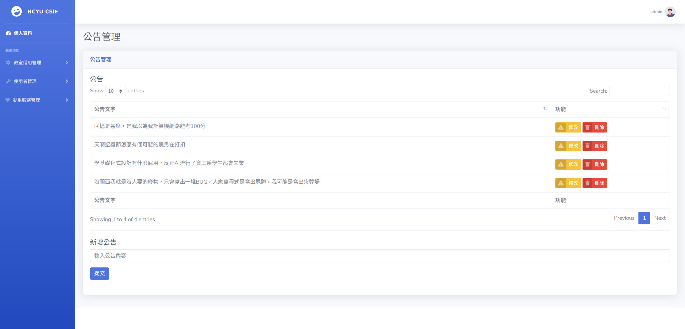

# 系上器材租用系統
##  團隊成員
* 1112923 徐聖凱
* 1112914 宋冠穎
* 1112943 李彥達
* 1112955 薛博徽
## 建置
1. 安裝 XAMPP。(php >= 8.1.0)
XAMPP: https://www.apachefriends.org/download.html
3. 將專案資料夾`webServerFinalProject`放到`C:\xampp\htdocs`下。
2. 開啟 XAMPP Control Panel ，啟用 Apache 、 MySQL 。
3. 修改 php 使用者預設密碼。
    1. 開啟 phpmyadmin 網頁將 root'@'localhost  使用者密碼改為`123456` 。
    2. 在 phpMyAdmin/config.inc.php 填入正確密碼。
     修改`C:\xampp\phpMyAdmin\config.inc.php` 
        ```
        /* Authentication type and info */
        $cfg['Servers'][$i]['auth_type'] = 'config';
        $cfg['Servers'][$i]['user'] = 'root';
        $cfg['Servers'][$i]['password'] = '123456';
        $cfg['Servers'][$i]['extension'] = 'mysqli';
        $cfg['Servers'][$i]['AllowNoPassword'] = true;
        $cfg['Lang'] = '';
        ```
5. 安裝 Composer 及所需套件。
    1. 安裝 Composer: https://getcomposer.org/download/
    2. 在專案根目錄下執行`composer install`。
6. 安裝預設資料庫  。 
    1. 進入 phpmyadmin 網頁，新增 `ncyucsie` 資料庫。
    2. 匯入 `webServerFinalProject\ncyucsie.sql` ，建立所需資料。
7. 建置完成。
瀏覽器開啟`http://localhost/webServerFinalProject/login.php`進入服務。

## 功能與系統簡介
本系統提供器材借用的功能，主要有幾個功能
* 管理員
  1. **教室借用管理**：系統管理員可以審核借用申請，決定是否借出。
  2. **使用者管理**：系統管理員可以新增、修改、刪除使用者資訊。
  3. **愛系服務管理**：系統管理員可以安排、修改、刪除愛系服務人員與時間。
  4. **公告管理**:系統管理員可以新增、修改、刪除公告。
* 使用者
  1. **教室借用**：使用者可以查看指定教室可借用時段，並提出借用申請。
  2. **愛系服務查詢**:使用者可以查看自己的違規記點情形與愛系服務時間。
  3. **公告欄**:使用者可以查看管理員發布的公告訊息。

## 功能展示
* 管理員
  1. **教室借用管理**
    
  2. **使用者管理**
    
    
  3. **愛系服務管理**
    
  4. **公告管理**
    
* 使用者
  1. **教室借用**
    
    
  2. **愛系服務查詢**
    
  3. **公告欄**
    
